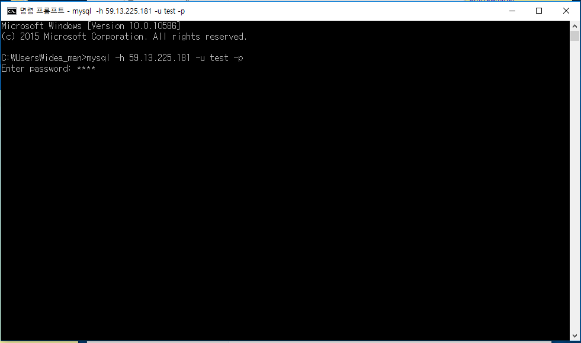
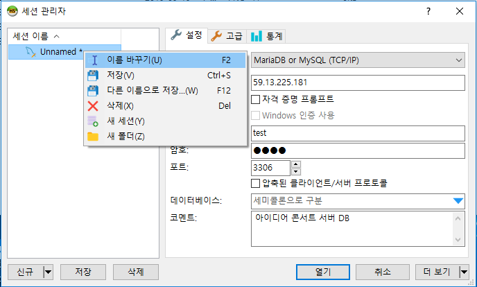

# 레드마인 DB 접속방법


- MySQL이 설치되어 있는 경우 DB에 콘솔 혹은 이클립스로 연결하는 방법: 

  **1. MySQL 연결 확인, 2. MySQL이 설치 및 연결되어 있을 경우 DB 접속방법** 참조

  

- MySQL의 별도 설치 및 기타 환경설정 없이 DB에 연결하는 좀 더 쉬운 방법: 

  **3-1. Heidi SQL 설치 및 DB 연결방법** 참조


---

## 목차

{:}


---

## 1. MySQL 연결 확인

### 1-1. cmd(명령 프롬프트) 창 열기

1. 왼쪽 하단 시작 화면에서 **웹 및 Windows 검색** 탭에 **cmd** 를 검색합니다.


2. **명령 프롬프트**를 클릭합니다.


### 1-2. MySQL 설치 및 환경변수 설정 여부 확인하기

1. cmd(명령 프롬프트)창을 열어주세요. (**0-1. cmd(명령 프롬프트)창 열기** 참조)

2. cmd창에  ***mysql --version***  를 입력합니다.

   아래와 같이 버전이 뜰 경우 mysql 설치되어 있으며, mysql 환경변수가 설정되어 있다는 것입니다. **1-1. cmd(명령 프롬프트) 창으로 DB 접속하기** 를 보고 DB에 접속해 주세요.


만약, **'mysql'은(는) 내부 또는 외부 명령, 실행할 수 있는 프로그램, 또는 배치 파일이 아닙니다.** 라는 문구가 뜰 경우 mysql 설치 및 환경변수 설정 여부를 확인해 주세요.


##### MySQL 설치 방법

- 자동설치: https://blog.naver.com/hj_veronica/220486027720

##### MySQL 환경변수 등록 방법

- 해당 문서의 환경변수 설정 방법 참조: https://blog.softbell.net/394


---

## 2. MySQL이 설치 및 연결되어 있을 경우 DB 접속방법

### 2-1. cmd(명령 프롬프트) 창으로 DB 접속하기

1. cmd(명령 프롬프트)창을 열어주세요. (**0-1. cmd(명령 프롬프트)창 열기** 참조)
2. cmd창에 ***mysql -h 59.13.225.181 -u test -p*** 를 입력한 후 엔터를 누릅니다.


3. 아래쪽에 Enter password: 가 뜨면 ***test*** 라고 입력한 후 엔터를 누릅니다.



4. 아래와 같은 화면이 뜨고, > 이전의 문구가 mysql로 바뀌어 있으면 정상적으로 DB에 접속된 것입니다.

   쿼리문(명령문)을 입력해 DB의 정보를 확인할 수 있습니다.


##### 간단한 콘솔 명령문

|                    하고싶은 일 | 명령어                                                   |
| -----------------------------: | -------------------------------------------------------- |
|              데이터베이스 보기 | **show databases;**                                      |
|        데이터베이스 접속(사용) | **use** *DB명* **;**                                     |
|           테이블(표) 목록 보기 | **show tables;**                                         |
|           테이블(표) 구조 보기 | **desc** *테이블명* **;**                                |
| 해당 테이블의 데이터 전체 검색 | **select** * **from** *테이블명*  **;**                  |
|  데이터 검색(특정 조건 하에서) | **select** * **from** *테이블명*  **where** *조건* **;** |


---

### 2-2. 이클립스에서 DB 연결하기

1. **application.properties** 파일에 들어가 주세요.

   해당 파일이 보이지 않을 경우, resources(mybatis.mapper 파일이 있는 곳)에 들어가 보세요.


2. 아래 사진과 같이 **url, username, password**를 설정해 주세요. (사진 아래 코드 참조)


```properties
spring.datasource.url=jdbc:mysql://59.13.225.181:3306/bitnami_redmine?serverTimezone=UTC
spring.datasource.username=test
spring.datasource.password=test
```


3. .xml 문서를 통해 DB에 쿼리를 보내고 결과값을 받아올 수 있습니다. (만약 이전에 설정해 둔 DB 값이 있다면, 위와 같이 바꿀 경우 이전에 설정해 놓은 DB는 사용할 수 없습니다.)


---

## 3. MySQL이 설치 및 연결되어 있지 않을 경우 DB 접속방법

### 3-1. Heidi SQL 설치 및 DB 연결방법

#### (1) Heidi SQL 설치하기

1. https://www.heidisql.com/download.php 로 접속해 주세요.

2. 다음 화면에서 **Installer, 32/64 bit cobined** 를 클릭해 파일을 다운로드받아주세요.


다운로드받은 파일의 모습입니다.


3. 다운로드받은 파일을 더블클릭해 실행해 주세요.

   *게시자를 알 수 없는 이 앱이 PC를 변경할 수 있도록 허용하시겠습니까?* 라는 알람이 뜨면 **예** 를 선택한 후 계속 진행해 주세요.

4. Ok 클릭하고 계속 next를 눌러 주세요. 따로 건드리지 않고 설치하시면 됩니다.


#### (2) Heidi SQL로 DB에 연결하기

1. 설치가 완료되면 프로그램을 실행시켜 주세요. 아래의 화면이 나올 경우 ***신규***  버튼을 눌러 주세요.


2. 아래에 적혀진 대로 정보를 입력해 주세요.

> 호스트명/IP : 59.13.225.181
>
> 사용자 : test
>
> 암호 : test
>
> 포트 : 3306


- 왼쪽의 세션 이름을 우클릭해 이름을 바꿀 수도 있습니다.




3. 왼쪽 아래의 ***저장***  버튼을 클릭합니다.


4. 저장되었다면 ***열기***  버튼을 클릭해 데이터베이스를 볼 수 있습니다.


> 열기 클릭 후 DB에 접속한 모습


- 저장해 두면, 다음번에 프로그램을 실행시켰을 때 바로 4번의 화면이 뜹니다. 열기 버튼을 눌러 DB에 접속하실 수 있습니다.

